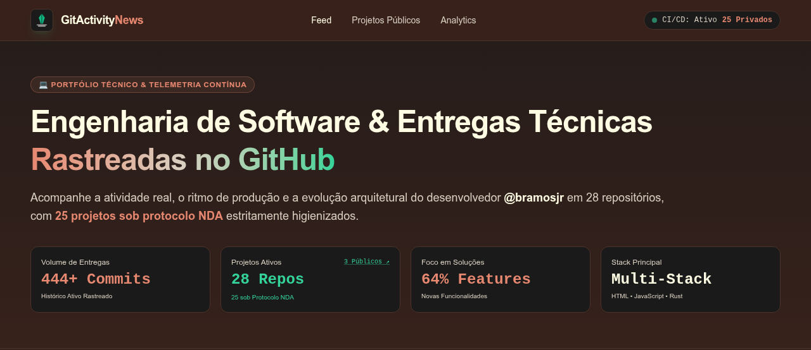
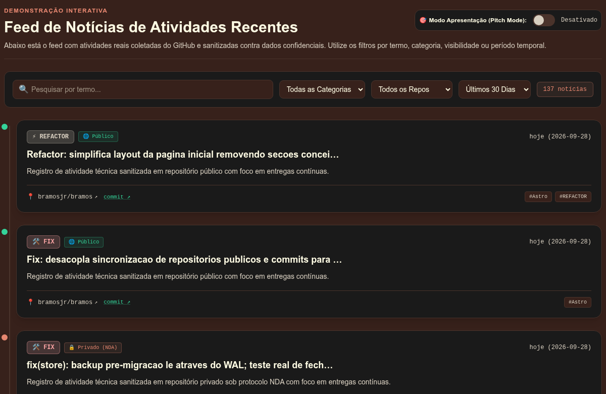
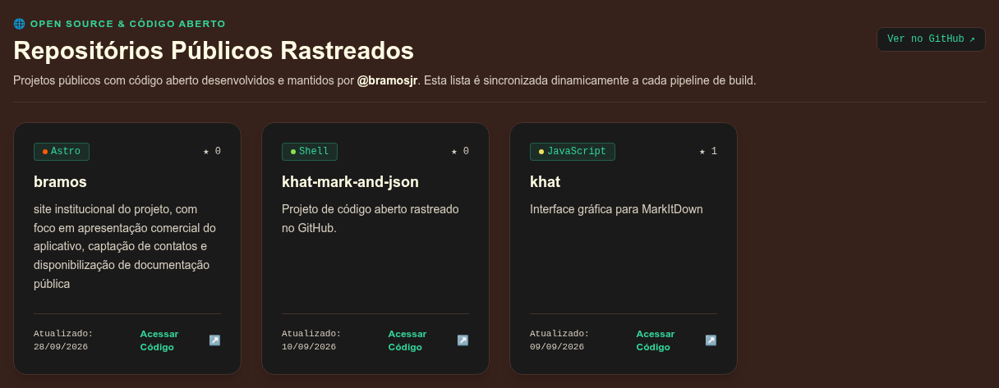
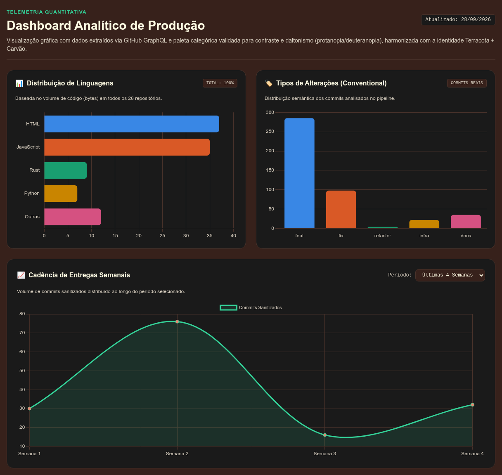
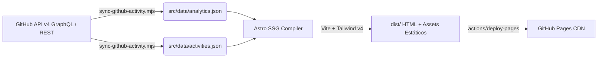

# GitActivityNews — Portfólio de Engenharia & Telemetria Contínua

<div align="center">

[](https://github.com/bramosjr/bramos/actions/workflows/deploy.yml)
[](https://astro.build)
[](https://tailwindcss.com)
[](https://nodejs.org)
[](LICENSE)

**Plataforma estática de telemetria de desenvolvimento contínuo, agregando atividades reais do GitHub com protocolo rígido de higienização de dados confidenciais (NDA).**

[🌐 Acessar Site ao Vivo](https://bramosjr.github.io/bramos/) • [📦 Repositórios Rastreados](#-repositórios-públicos-rastreados) • [📊 Dashboard Analítico](#-dashboard-analítico-de-produção)

</div>

---

## 📌 Sumário

- [Visão Geral](#-visão-geral)
- [Demonstração Visual](#-demonstração-visual)
  - [1. Hero & Métricas de Cabeçalho](#1-hero--métricas-de-cabeçalho)
  - [2. Feed de Atividades Recentes](#2-feed-de-atividades-recentes)
  - [3. Repositórios Públicos Rastreados](#3-repositórios-públicos-rastreados)
  - [4. Dashboard Analítico de Produção](#4-dashboard-analítico-de-produção)
- [Arquitetura Técnica & Pipeline CI/CD](#-arquitetura-técnica--pipeline-cicd)
  - [Ingestão Desacoplada e Resiliente](#ingestão-desacoplada-e-resiliente)
  - [Protocolo de Sanitização sob NDA](#protocolo-de-sanitização-sob-nda)
- [Desenvolvimento Local](#-desenvolvimento-local)
- [Estrutura do Projeto](#-estrutura-do-projeto)
- [Licença & Autor](#-licença--autor)

---

## 💡 Visão Geral

O **GitActivityNews** é um portfólio de engenharia de software desenvolvido em **Astro v7** e **Tailwind CSS v4**, focado em demonstrar ritmo de produção real, densidade de entregas e ecossistema tecnológico multiplataforma (HTML/JS, Rust, Python, Apps Script, Shell).

A plataforma consome metadados e histórico de commits da API do GitHub via pipeline automatizado no GitHub Actions, garantindo que recrutadores, clientes e a comunidade técnica possam acompanhar a cadência viva de entregas sem que nenhum identificador comercial ou segredo corporativo sob **protocolo de confidencialidade (NDA)** seja exposto.

---

## 📸 Demonstração Visual

### 1. Hero & Métricas de Cabeçalho

Apresentação executiva com contadores em tempo real derivados diretamente dos repositórios rastreados (volume total de commits, repositórios sob protocolo NDA, proporção de funcionalidades e stack tecnológica principal).

<div align="center">
  
</div>

---

### 2. Feed de Atividades Recentes

Timeline interativa com filtro instantâneo por termo, categoria semântica (*feat*, *fix*, *refactor*, *infra*, *docs*), repositório e janela temporal. Commits privados têm títulos normalizados e identificadores internos removidos.

<div align="center">
  
</div>

---

### 3. Repositórios Públicos Rastreados

Grade dinâmica com os projetos de código aberto mantidos por [@bramosjr](https://github.com/bramosjr), exibindo metadados de linguagem principal, contadores de estrelas, forks, descrição e link direto para o código-fonte.

<div align="center">
  
</div>

---

### 4. Dashboard Analítico de Produção

Painel analítico renderizado via Chart.js contendo:
- **Distribuição de Linguagens:** Proporção percentual calculada com base no volume de bytes de código em todos os repositórios.
- **Tipos de Alterações:** Categorização semântica padronizada baseada em *Conventional Commits*.
- **Cadência de Entregas Semanais:** Gráfico de linha temporal com seletor dinâmico e persistente (*Últimas 4 Semanas*, *8 Semanas*, *3 Meses* ou *Todo Período*).

<div align="center">
  
</div>

---

## 🛠️ Arquitetura Técnica & Pipeline CI/CD

O projeto opera sob o modelo **Static Site Generation (SSG)** com compilação ultra-rápida e custo zero de hospedagem no GitHub Pages.



### Ingestão Desacoplada e Resiliente

O script de sincronização (`scripts/sync-github-activity.mjs`) utiliza uma estratégia em duas fases para blindar a compilação contra timeouts de gateway (HTTP 504) e variações de rede:

1. **Fase A (Repositórios e Metadados):** Consulta GraphQL ultra-leve que obtém todos os repositórios, visibilidade, linguagens e dados públicos sem aninhar histórico de commits (tempo de resposta < 1,5s). Em caso de indisponibilidade do GraphQL, conta com fallback transparente via REST API (`/users/{login}/repos`).
2. **Fase B (Telemetria e Commits):** Consulta calibrada para os 30 repositórios recentemente atualizados, com profundidade de 25 commits por branch. Se a Fase B falhar por oscilação externa, a lista de repositórios públicos já está salva e o histórico analítico pré-existente em cache é reutilizado de forma granular.

### Protocolo de Sanitização sob NDA

Para repositórios privados, a rotina de ingestão aplica:
- Ocultação do nome real do repositório (substituído por `Projeto Privado: Solução em [Linguagem]`).
- Limpeza de referências a issues internas (`#123`, `Closes #456`) e pull requests.
- Normalização de mensagens de commit baseada em padrões semânticos de engenharia.
- Remoção de links diretos de commit para repositórios não públicos.

---

## 🚀 Desenvolvimento Local

### Pré-requisitos
- **Node.js** >= 20 (recomendado Node 22+ ou 24 LTS)
- **npm** ou gerenciador de pacotes equivalente
- **GitHub CLI (`gh`)** autenticado (opcional, para sincronizar dados privados localmente)

### Instalação

1. Clone o repositório:
```bash
git clone https://github.com/bramosjr/bramos.git
cd bramos
```

2. Instale as dependências:
```bash
npm install
```

3. Sincronize os dados de atividade do GitHub (opcional se já houver cache local):
```bash
npm run sync:activity
```

4. Inicie o servidor de desenvolvimento:
```bash
npm run dev
```
Acesse `http://localhost:4321/bramos/` no navegador.

5. Compile a versão de produção (SSG):
```bash
npm run build
```
Os arquivos estáticos finais serão gerados no diretório `dist/`.

---

## 📁 Estrutura do Projeto

```text
gitpages/
├── .github/
│   └── workflows/
│       └── deploy.yml          # Pipeline CI/CD (push na master + cron diário)
├── public/
│   ├── favicon.svg             # Ícone do site
│   ├── logo.png                # Logotipo da aplicação
│   └── screenshots/            # Capturas de tela utilizadas na documentação
│       ├── 01-hero-metricas.png
│       ├── 02-feed-timeline.png
│       ├── 03-repositorios-publicos.png
│       └── 04-analytics-dashboard.png
├── scripts/
│   └── sync-github-activity.mjs # Ingestor GraphQL/REST desacoplado e sanitizador
├── src/
│   ├── components/             # Componentes Astro da interface
│   │   ├── AnalyticsDashboard.astro
│   │   ├── FeedTimeline.astro
│   │   ├── Footer.astro
│   │   ├── Hero.astro
│   │   ├── Navbar.astro
│   │   └── PublicRepos.astro
│   ├── data/                   # Datasets gerados em tempo de compilação
│   │   ├── activities.json     # Histórico de atividades sanitizadas
│   │   └── analytics.json      # Métricas de cadência, linguagens e repositórios
│   ├── layouts/
│   │   └── Layout.astro        # Layout base com meta tags e import de estilos
│   ├── pages/
│   │   └── index.astro         # Página inicial consolidada
│   └── styles/
│       └── global.css          # Estilos globais e tokens Tailwind CSS v4
├── astro.config.mjs            # Configuração do Astro (base path, Vite, Tailwind)
├── package.json
└── README.md                   # Documentação técnica do repositório
```

---

## 📄 Licença & Autor

Desenvolvido e mantido por **Jorge Ramos Jr** ([@bramosjr](https://github.com/bramosjr)).  
Distribuído sob a licença [MIT](LICENSE).
